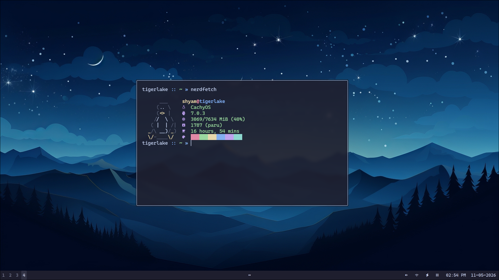

# dotfiles-catinblue

A beautiful, cohesive Hyprland configuration built around the Catppuccin Mocha theme for maximum aesthetic appeal.




This setup is built around the "Catppuccin Mocha" theme (#1e1e2e background and #cdd6f4 foreground). It uses **Hyprland** as the compositor, **Noctalia Shell** as the desktop shell, and **Kitty** as the terminal emulator.

### Core Components
- **Compositor:** [Hyprland](https://hyprland.org/)
- **Desktop Shell:** [Noctalia Shell](https://noctalia.dev/)
- **Terminal:** [Kitty](https://sw.kovidgoyal.net/kitty/) / [Ghostty](https://ghostty.org/)
- **Login Manager:** [SDDM](https://github.com/sddm/sddm) (with custom catinblue-mono theme)
- **Application Launcher:** [Noctalia Shell](https://noctalia.dev/)
- **Shell:** [Zsh](https://www.zsh.org/) (custom minimal config)
- **Session Menu:** [Noctalia Shell](https://noctalia.dev/)
- **Notification System:** [Noctalia Shell](https://noctalia.dev/)
- **Wallpaper Utility:** [Swaybg](https://github.com/swaywm/swaybg)
- **Idle/Lock:** [Hypridle](https://github.com/hyprwm/hypridle) & [Hyprlock](https://github.com/hyprwm/hyprlock)

## 🚀 Installation & Setup

### 1. Clone the repository
```bash
git clone https://github.com/shyamjames/dotfiles-catinblue.git ~/dotfiles-catinblue
```

### 2. One-click dependency install (yay + optional stow)
This command downloads and runs the installer script directly.

```bash
curl -fsSL https://raw.githubusercontent.com/shyamjames/dotfiles-catinblue/main/install.sh | bash
```

### 3. Install GNU Stow and symlink configurations
This repo uses [GNU Stow](https://www.gnu.org/software/stow/) to manage symlinks. Each top-level directory is a stow package that mirrors the target directory structure relative to `~`.

> [!IMPORTANT]
> Make sure to backup your existing configurations before running these commands.

```bash
# Install stow (Arch)
sudo pacman -S stow

# Stow all packages (creates symlinks in ~)
cd ~/dotfiles-catinblue
stow hypr ghostty kitty rofi zsh alacritty nvim

# SDDM theme must be copied manually (requires root)
sudo cp -r ~/dotfiles-catinblue/sddm/catinblue-mono /usr/share/sddm/themes/
```

To remove symlinks for a specific package:
```bash
stow -D hypr
```

To restow (remove + re-link) a package:
```bash
stow -R hypr
```

### 4. Configure Noctalia and Zsh
This setup relies on **Noctalia Shell** for the desktop shell and **Oh My Zsh** plus `zsh-autosuggestions` for the interactive shell. Install them before logging in:

```bash
# Install Noctalia Shell (Arch / AUR)
yay -S noctalia-shell
```

```bash
# Install Oh My Zsh
sh -c "$(curl -fsSL https://raw.githubusercontent.com/ohmyzsh/ohmyzsh/master/tools/install.sh)"

# Install zsh-autosuggestions plugin
git clone https://github.com/zsh-users/zsh-autosuggestions ${ZSH_CUSTOM:-~/.oh-my-zsh/custom}/plugins/zsh-autosuggestions
```

### 5. Configure SDDM (Login Screen)
Create the directory if it doesn't exist and define the current theme:
```bash
sudo mkdir -p /etc/sddm.conf.d
echo "[Theme]
Current=catinblue-mono" | sudo tee /etc/sddm.conf.d/theme.conf
```

### 6. Dependencies
The following packages are required for this setup:

- `hyprland`
- `noctalia-shell`
- `ghostty`
- `kitty`
- `zsh`
- `rofi`
- `swaybg`
- `hypridle`
- `hyprlock`
- `thunar`
- `ttf-cascadia-code-nerd`
- `brightnessctl`
- `playerctl`
- `hyprshot`
- `cliphist`
- `sddm`
- `imagemagick`
- `blueman`
- `bluez`
- `bluez-utils`
- `pipewire`
- `wireplumber`
- `pipewire-pulse`
- `pavucontrol`
- `networkmanager` (nmcli)
- `wireless_tools` (iwgetid)
- `libnotify` (notify-send)
- `curl`

> [!NOTE]
> This setup uses **PipeWire** with **WirePlumber** for audio. Ensure `pipewire`, `wireplumber`, and `pipewire-pulse` are installed and running for volume controls to work in the shell.


| Key | Action |
| --- | --- |
| `Super + Return` | Open Kitty |
| `Super + Q` | Kill Active Window |
| `Super + E` | Open Thunar |
| `Super + A` | Toggle Noctalia Launcher |
| `Super + V` | Open Noctalia Clipboard |
| `Super + B` | Open Brave Browser |
| `Super + Backspace` | Open Noctalia Session Menu |
| `Super + Shift + W` | Toggle Noctalia Bar |
| `Print` | Screenshot Menu (Fullscreen/Window/Area) |

> [!NOTE]
> If you use this on a network with a captive portal (login page), run `bash ~/.config/hypr/scripts/setup.sh` once after setup. Fill in your credentials in `~/.config/hypr/scripts/.env` (see `.env.example`). You may also need to edit `login.sh` and `watch-network.sh` to match your portal's URL and your network's SSID.